<div align="center">

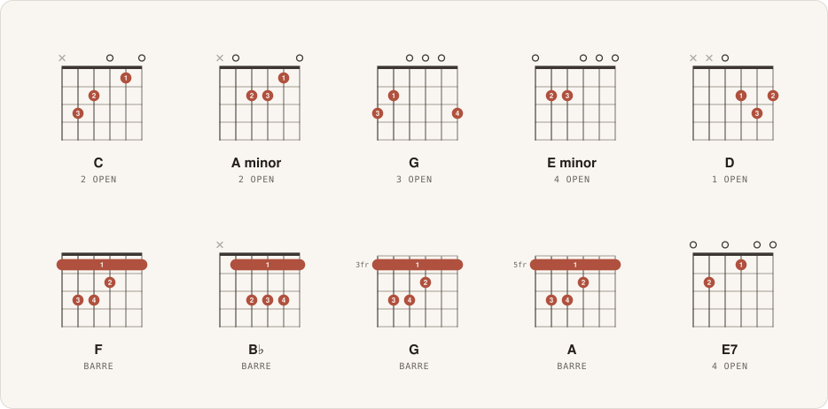

# Guitar Charts

**Pass in a shape, get back a diagram.**

Chord diagrams for SwiftUI, Jetpack Compose, React and React Native, with the same geometry on every platform.

[](#swift)
[](#swift)
[](#kotlin)
[](#kotlin)
[](#react)
[](#react-native)
[](LICENSE)

[Quick start](#quick-start) ·
[Views](#views) ·
[Examples](#examples)

</div>

---

## Highlights

- **Plain data in, a diagram out.** Frets, optional fingers, an optional barre. No drawing code on your side.
- **Drawn, not bundled.** SwiftUI and Compose `Canvas`, inline SVG in React, `react-native-svg` in React Native. No WebViews, bitmaps or icon fonts, so it scales cleanly to any size.
- **Identical everywhere.** All four draw exactly the same geometry.
- **Export built in.** Vector SVG or PNG at any scale, handed to the share sheet, a download, or your own code.
- **Accessible.** VoiceOver, TalkBack and web screen readers read the shape out.

## Anatomy of a diagram

<p align="center">
  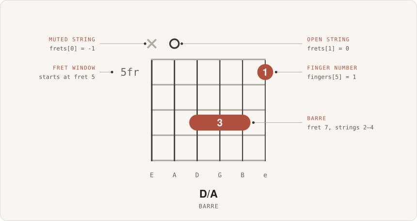
</p>

```js
{
  name:    "D/A",
  frets:   [-1, 0, 7, 7, 7, 5],                  // low E → high e: -1 muted, 0 open, n = fret
  fingers: [ 0, 0, 3, 3, 3, 1],                  // optional
  barre:   { fret: 7, from: 2, to: 4, finger: 3 }, // optional, from/to are string indices
  caption: "barre"                               // optional, derived when omitted
}
```

Shapes above the 4th fret slide the four-fret window down the neck and label it (`5fr`, `12fr`).

## Quick start

### Swift

```swift
// Package.swift
.package(url: "https://github.com/LiamDotPro/guitar-charts.git", from: "0.1.0")
// target dependency: .product(name: "ChordDiagram", package: "guitar-charts")
```

```swift
import ChordDiagram

struct ContentView: View {
    var body: some View {
        ChordCard(ChordLibrary.c)
            .frame(width: 148)
    }
}
```

### Kotlin

Not on Maven Central yet. Build from a checkout, or run `./gradlew publishToMavenLocal` in `kotlin/`.

```kotlin
// the app's settings.gradle.kts
includeBuild("../guitar-charts/kotlin")

// app/build.gradle.kts
dependencies {
    implementation("com.guitarcharts:chord-diagram-compose:0.1.0")
}
```

```kotlin
@Composable
fun Greeting() {
    ChordCard(ChordLibrary.C, Modifier.width(148.dp))
}
```

### React

Not on npm yet. Pack the packages from a checkout, then install the tarballs:

```sh
# in guitar-charts
npm install && npm run build:js
npm pack -w js/core -w js/react --pack-destination ../packages

# in your app
npm install ../packages/guitar-charts-core-0.1.0.tgz ../packages/guitar-charts-react-0.1.0.tgz
```

```tsx
import { ChordCard, ChordLibrary } from "@guitar-charts/react";

export function Greeting() {
  return <ChordCard chord={ChordLibrary.C} style={{ width: 148 }} />;
}
```

### React Native

Pack `js/core` and `js/react-native` the same way, and add `react-native-svg`:

```sh
npm install ../packages/guitar-charts-core-0.1.0.tgz ../packages/guitar-charts-react-native-0.1.0.tgz react-native-svg
```

```tsx
import { ChordCard, ChordLibrary } from "@guitar-charts/react-native";

export function Greeting() {
  return <ChordCard chord={ChordLibrary.C} style={{ width: 148 }} />;
}
```

## Views

| | SwiftUI | Compose | React · React Native |
|---|---|---|---|
| The diagram alone | `ChordDiagramView` | `ChordDiagram` | `ChordDiagram` |
| Diagram, name, caption and export link | `ChordCard` | `ChordCard` | `ChordCard` |
| A full scrollable sheet | `ChordSheetView` | `ChordSheet` | `ChordSheet` |

<p align="center">
  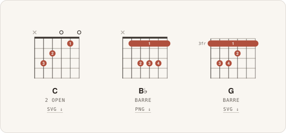
</p>

<table>
  <tr>
    <td width="30%" valign="top">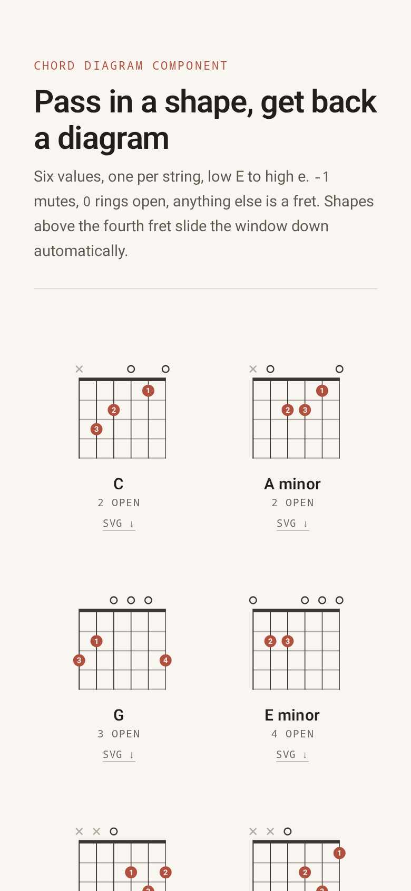</td>
    <td valign="top">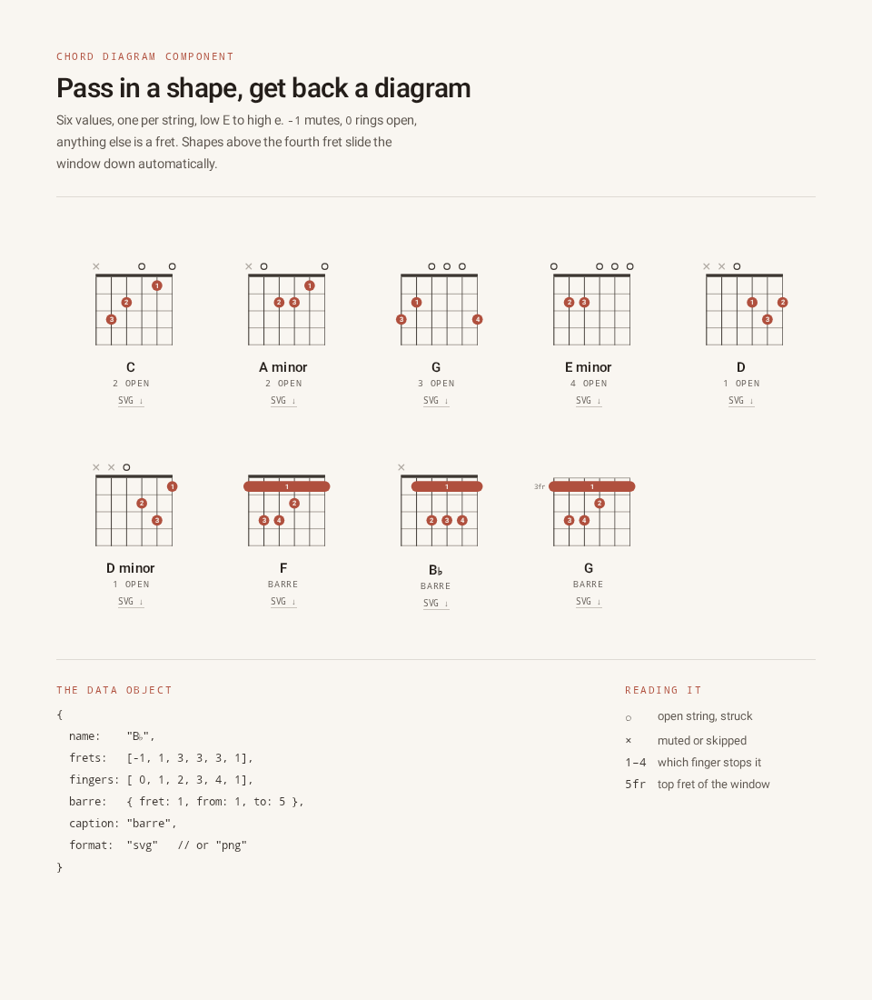</td>
  </tr>
  <tr>
    <td align="center"><sub><code>ChordSheet()</code> on a phone</sub></td>
    <td align="center"><sub>…and at tablet width</sub></td>
  </tr>
  <tr>
    <td colspan="2">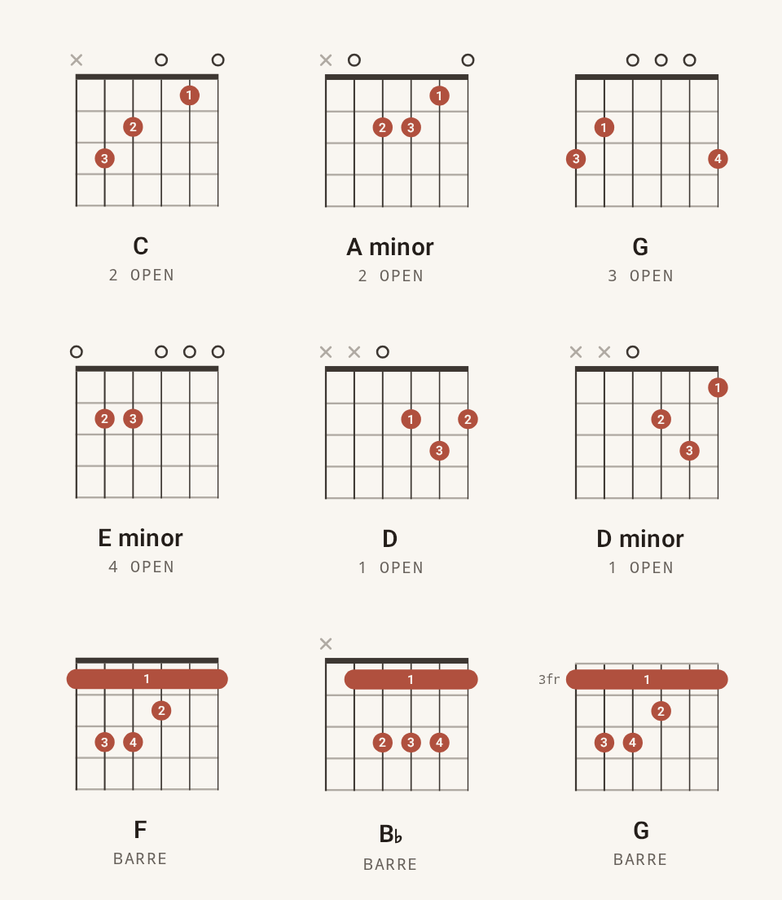</td>
  </tr>
  <tr>
    <td colspan="2" align="center"><sub>Every chord in <code>ChordLibrary</code>, as <code>ChordCard</code>s</sub></td>
  </tr>
</table>

## Examples

React and React Native share one API, so each TSX snippet works in both unless its first line says otherwise.

### Your own shapes

<p align="center">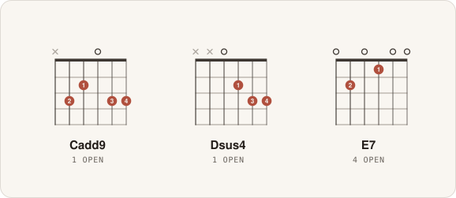</p>

<details>
<summary>Show code</summary>

```swift
let cadd9 = Chord(name: "Cadd9", frets: [-1, 3, 2, 0, 3, 3], fingers: [0, 2, 1, 0, 3, 4])
let dsus4 = Chord(name: "Dsus4", frets: [-1, -1, 0, 2, 3, 3], fingers: [0, 0, 0, 1, 3, 4])
let e7 = Chord(name: "E7", frets: [0, 2, 0, 1, 0, 0], fingers: [0, 2, 0, 1, 0, 0])

HStack(spacing: 12) {
    ForEach([cadd9, dsus4, e7], id: \.self) { ChordCard($0) }
}
```

```kotlin
val cadd9 = Chord(name = "Cadd9", frets = listOf(-1, 3, 2, 0, 3, 3), fingers = listOf(0, 2, 1, 0, 3, 4))
val dsus4 = Chord(name = "Dsus4", frets = listOf(-1, -1, 0, 2, 3, 3), fingers = listOf(0, 0, 0, 1, 3, 4))
val e7 = Chord(name = "E7", frets = listOf(0, 2, 0, 1, 0, 0), fingers = listOf(0, 2, 0, 1, 0, 0))

Row(horizontalArrangement = Arrangement.spacedBy(12.dp)) {
    listOf(cadd9, dsus4, e7).forEach { ChordCard(it, Modifier.weight(1f)) }
}
```

```tsx
const cadd9: Chord = { name: "Cadd9", frets: [-1, 3, 2, 0, 3, 3], fingers: [0, 2, 1, 0, 3, 4] };
const dsus4: Chord = { name: "Dsus4", frets: [-1, -1, 0, 2, 3, 3], fingers: [0, 0, 0, 1, 3, 4] };
const e7: Chord = { name: "E7", frets: [0, 2, 0, 1, 0, 0], fingers: [0, 2, 0, 1, 0, 0] };

export const CustomShapes = () => [cadd9, dsus4, e7].map((chord) => <ChordCard key={chord.name} chord={chord} />);
```

</details>

### Barre chords and the fret window

<p align="center">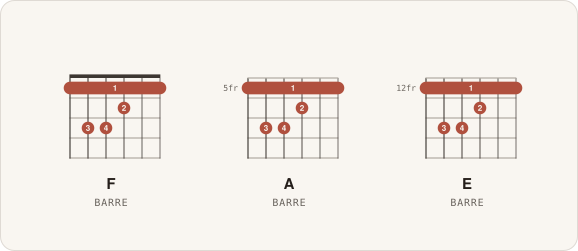</p>

<details>
<summary>Show code</summary>

```swift
let a = Chord(name: "A", frets: [5, 7, 7, 6, 5, 5], fingers: [1, 3, 4, 2, 1, 1],
              barre: Barre(fret: 5, from: 0, to: 5, finger: 1)) // strings 0–5 at fret 5
let e = Chord(name: "E", frets: [12, 14, 14, 13, 12, 12], fingers: [1, 3, 4, 2, 1, 1],
              barre: Barre(fret: 12, from: 0, to: 5, finger: 1))

HStack(spacing: 12) {
    ForEach([ChordLibrary.f, a, e], id: \.self) { ChordCard($0) }
}
```

```kotlin
val a = Chord(
    name = "A", frets = listOf(5, 7, 7, 6, 5, 5), fingers = listOf(1, 3, 4, 2, 1, 1),
    barre = Barre(fret = 5, from = 0, to = 5, finger = 1), // strings 0–5 at fret 5
)
val e = Chord(
    name = "E", frets = listOf(12, 14, 14, 13, 12, 12), fingers = listOf(1, 3, 4, 2, 1, 1),
    barre = Barre(fret = 12, from = 0, to = 5, finger = 1),
)

Row(horizontalArrangement = Arrangement.spacedBy(12.dp)) {
    listOf(ChordLibrary.F, a, e).forEach { ChordCard(it, Modifier.weight(1f)) }
}
```

```tsx
const a: Chord = {
  name: "A", frets: [5, 7, 7, 6, 5, 5], fingers: [1, 3, 4, 2, 1, 1],
  barre: { fret: 5, from: 0, to: 5, finger: 1 }, // strings 0–5 at fret 5
};
const e: Chord = {
  name: "E", frets: [12, 14, 14, 13, 12, 12], fingers: [1, 3, 4, 2, 1, 1],
  barre: { fret: 12, from: 0, to: 5, finger: 1 },
};

export const Barres = () => [ChordLibrary.F, a, e].map((chord) => <ChordCard key={chord.name} chord={chord} />);
```

</details>

### A chord chart for a song

<p align="center">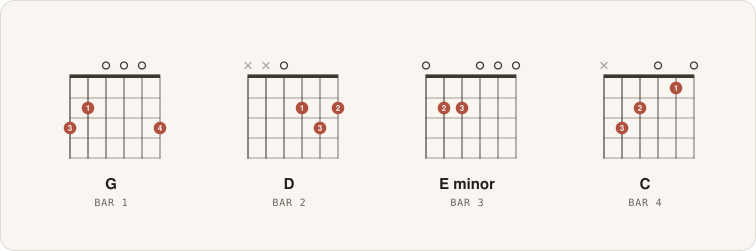</p>

<details>
<summary>Show code</summary>

```swift
let song = zip([ChordLibrary.g, ChordLibrary.d, ChordLibrary.em, ChordLibrary.c], 1...)
    .map { chord, bar -> Chord in
        var chord = chord
        chord.caption = "bar \(bar)"
        return chord
    }

HStack(spacing: 12) {
    ForEach(song, id: \.self) { ChordCard($0) }
}
```

```kotlin
val song = listOf(ChordLibrary.G, ChordLibrary.D, ChordLibrary.Em, ChordLibrary.C)
    .zip(1..4) { chord, bar -> chord.copy(caption = "bar $bar") }

Row(horizontalArrangement = Arrangement.spacedBy(12.dp)) {
    song.forEach { ChordCard(it, Modifier.weight(1f)) }
}
```

```tsx
const song = [ChordLibrary.G, ChordLibrary.D, ChordLibrary.Em, ChordLibrary.C]
  .map((chord, i) => ({ ...chord, caption: `bar ${i + 1}` }));

export const Song = () => song.map((chord) => <ChordCard key={chord.caption} chord={chord} />);
```

</details>

### Accent colors

<p align="center">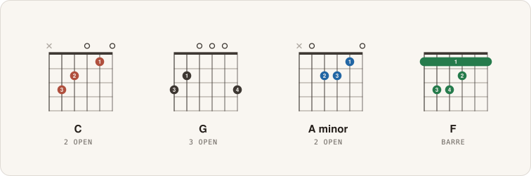</p>

<details>
<summary>Show code</summary>

```swift
let chords = [ChordLibrary.c, ChordLibrary.g, ChordLibrary.am, ChordLibrary.f]

HStack(spacing: 12) {
    ForEach(chords.indices, id: \.self) { i in
        ChordCard(chords[i], options: ChordLayoutOptions(accent: ChordTokens.accents[i].hex))
    }
}
```

```kotlin
val chords = listOf(ChordLibrary.C, ChordLibrary.G, ChordLibrary.Am, ChordLibrary.F)

Row(horizontalArrangement = Arrangement.spacedBy(12.dp)) {
    chords.forEachIndexed { i, chord ->
        ChordCard(chord, Modifier.weight(1f), ChordLayoutOptions(accent = ChordTokens.Accents[i].hex)) // or any "#rrggbb"
    }
}
```

```tsx
const chords = [ChordLibrary.C, ChordLibrary.G, ChordLibrary.Am, ChordLibrary.F];

export const Accents = () =>
  chords.map((chord, i) => (
    <ChordCard key={chord.name} chord={chord} options={{ accent: ChordTokens.accents[i].hex }} /> // or any "#rrggbb"
  ));
```

</details>

### Hide finger numbers

<p align="center">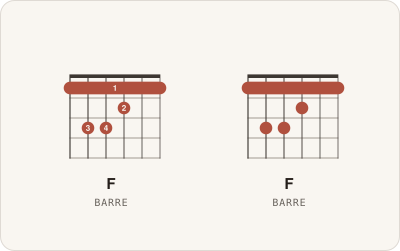</p>

<details>
<summary>Show code</summary>

```swift
HStack(spacing: 12) {
    ChordCard(ChordLibrary.f)
    ChordCard(ChordLibrary.f, options: ChordLayoutOptions(showFingers: false))
}
```

```kotlin
Row(horizontalArrangement = Arrangement.spacedBy(12.dp)) {
    ChordCard(ChordLibrary.F, Modifier.weight(1f))
    ChordCard(ChordLibrary.F, Modifier.weight(1f), ChordLayoutOptions(showFingers = false))
}
```

```tsx
export const HideFingers = () => (
  <>
    <ChordCard chord={ChordLibrary.F} />
    <ChordCard chord={ChordLibrary.F} options={{ showFingers: false }} />
  </>
);
```

</details>

### Export SVG and PNG

<p align="center">
  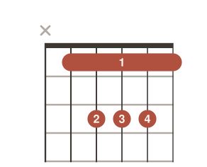
  <br>
  <sub>This image <em>is</em> the exported file: <code>b-.svg</code> at scale 2, unedited.</sub>
</p>

<details>
<summary>Show code</summary>

```swift
let svg: Data = ChordExporter.svgData(ChordLibrary.bb)          // vector
let png: Data? = ChordExporter.pngData(ChordLibrary.bb, scale: 4) // 584 × 472, @MainActor

// A share button that hands out a named file
ShareLink(item: ChordExportFile(chord: ChordLibrary.bb, format: .png),
          preview: SharePreview("B♭ chord diagram"))

// Or let the card do it
ChordCard(ChordLibrary.bb, showDownload: true, format: .png)
```

```kotlin
val svg: String = ChordExporter.svg(ChordLibrary.Bb)                   // vector
val png: Bitmap = ChordExporter.png(context, ChordLibrary.Bb, scale = 4) // 584 × 472

// Opens the system share sheet: Files, Drive, Messages…
ChordExporter.share(context, ChordLibrary.Bb, format = ChordExportFormat.PNG)

// Or let the card do it
ChordCard(ChordLibrary.Bb, showDownload = true, format = ChordExportFormat.PNG)
```

```tsx
// React
const svg = chordSvg(ChordLibrary.Bb);                   // vector
const png = await chordPng(ChordLibrary.Bb, undefined, 4); // Blob, 584 × 472
await downloadChord(ChordLibrary.Bb, { format: "png" });   // saves b-.png

// Or let the card do it
<ChordCard chord={ChordLibrary.Bb} showDownload format="png" />
```

```tsx
// React Native: the card hands you the file to save or share (iOS opens the share sheet if you don't)
<ChordCard
  chord={ChordLibrary.Bb}
  showDownload
  format="png"
  onExport={(file) => saveAndShare(file.fileName, file.data, file.encoding)} // PNG arrives as base64
/>
```

</details>

### Render on a server, or draw it yourself

The cores have no UI dependency, and a layout is just flat primitives in a 146 × 118 space.

<details>
<summary>Show code</summary>

```kotlin
// chord-diagram-core on the JVM
File("c-major.svg").writeText(layoutChord(ChordLibrary.C).toSvg(scale = 2.0))
```

```swift
// ChordDiagramCore on Linux or macOS
let svg = ChordLayout(chord: ChordLibrary.c).svg(scale: 2)
```

```ts
// @guitar-charts/core in Node, no DOM needed
const svg = chordSvg(ChordLibrary.C, undefined, 2);
```

```kotlin
val layout = layoutChord(ChordLibrary.Am)
val dots = layout.circles.filter { it.id == ChordLayout.PrimitiveId.DOT } // fretted notes, in design units
val window = layout.position                                               // 1 at the nut, 5 for "5fr"

val textMeasurer = rememberTextMeasurer()
Canvas(Modifier.size(292.dp, 236.dp)) {
    drawChordLayout(layout, textMeasurer) // or walk layout.rects / lines / circles / texts yourself
}
```

```tsx
// React; in React Native, wrap ChordShapes in <Svg> from react-native-svg instead
export const DrawItYourself = () => (
  <svg viewBox="0 0 146 118" width={292}>
    <ChordShapes layout={layoutChord(ChordLibrary.Am)} />
  </svg>
);
```

</details>

## License

[MIT](LICENSE)
