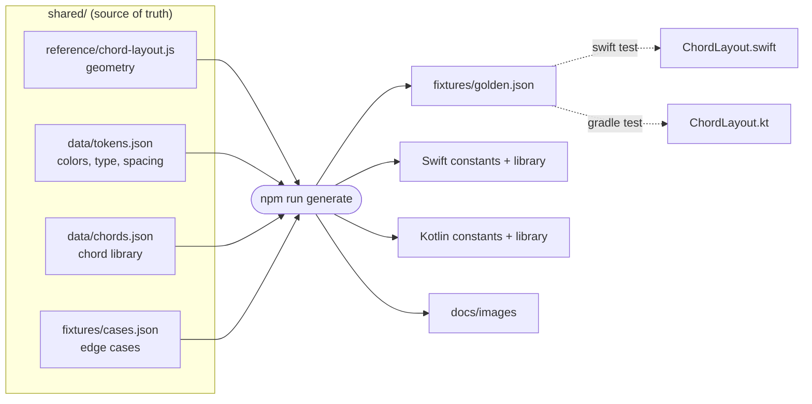

<div align="center">


# Guitar Charts

**Pass in a shape, get back a diagram.**

Native chord diagrams for SwiftUI and Jetpack Compose. Both are drawn from one
shared layout spec, and tests hold every platform to the same geometry.

[](#swift-swiftui)
[](#swift-swiftui)
[](#kotlin-jetpack-compose)
[](#kotlin-jetpack-compose)
[](#roadmap)

[Quick start](#quick-start) ·
[Examples](#examples) ·
[Swift](#swift-swiftui) ·
[Kotlin](#kotlin-jetpack-compose) ·
[How it works](#how-it-stays-identical) ·
[Development](#development)

</div>

---

## Highlights

- **Six numbers in, a diagram out.** A chord is plain data: frets, optional fingers, an optional barre. No drawing code on your side.
- **Truly native.** SwiftUI `Canvas` on Apple platforms, Compose `Canvas` on Android. No WebViews, no bitmaps, no icon fonts. It scales cleanly to any size.
- **Identical everywhere, enforced by tests.** Every port must reproduce the reference layout to within 1e-9 and its SVG output byte for byte.
- **Smart fret window.** Shapes above the 4th fret slide the window down and label it (`5fr`, `12fr`).
- **Export built in.** You get a vector SVG, a PNG at any scale, or the system share sheet, with finger numbers baked into the file.
- **Accessible.** VoiceOver and TalkBack read the shape out: *"C chord. low E muted, A fret 3 finger 3, …"*.

## Anatomy of a diagram

<p align="center">
  
</p>

Every diagram comes from one small data object:

```js
{
  name:    "D/A",
  frets:   [-1, 0, 7, 7, 7, 5],                  // one per string, low E → high e
  fingers: [ 0, 0, 3, 3, 3, 1],                  // optional
  barre:   { fret: 7, from: 2, to: 4, finger: 3 }, // optional
  caption: "barre"                               // optional
}
```

| Field | Meaning |
|---|---|
| `frets` | Six values, low E (index 0) to high e (index 5). `-1` mutes the string, `0` rings open, `n` stops it at fret `n`. |
| `fingers` | Which finger (1–4) stops each string. `0` or missing draws no number. |
| `barre` | One finger across strings `from`…`to`. These are **string indices**, not frets. It hides the dots it covers and carries a single number. |
| `caption` | The small line under the name. When omitted it's derived: `barre`, `N open`, or `closed`. |

**The fret window** shows four frets. It starts at the nut whenever the highest
note is at fret 4 or below. Otherwise it starts at the lowest fretted note, if
the shape fits in four frets, or slides down until the highest note is on the
last row. When it doesn't start at the nut, the nut becomes a thin line and an
`Nfr` marker appears.

## Packages

| | Swift | Kotlin |
|---|---|---|
| **Libraries** | `ChordDiagram` (SwiftUI) · `ChordDiagramCore` | `chord-diagram-compose` · `chord-diagram-core` |
| **Platforms** | iOS 16+ · macOS 13+ | Android minSdk 24 · compileSdk 37 |
| **Views** | `ChordDiagramView` · `ChordCard` · `ChordSheetView` | `ChordDiagram` · `ChordCard` · `ChordSheet` |
| **Export** | `ChordExporter` · `ChordExportFile` (`ShareLink`) | `ChordExporter` (share sheet) |
| **Pure core** | Builds on Linux | Plain JVM: servers, CLIs, build scripts |
| **Tests** | Golden conformance | Golden conformance + Compose screenshot tests |

## Quick start

### Swift

```swift
// Package.swift
.package(url: "https://github.com/<you>/guitar-charts.git", from: "0.1.0")
// target dependency: .product(name: "ChordDiagram", package: "guitar-charts")
```

```swift
import ChordDiagram

struct ContentView: View {
    var body: some View {
        ChordCard(ChordLibrary.c)
            .frame(width: 148)
    }
}
```

### Kotlin

```kotlin
// the app's settings.gradle.kts: build straight from a checkout
includeBuild("../guitar-charts/kotlin")

// app/build.gradle.kts
dependencies {
    implementation("com.guitarcharts:chord-diagram-compose:0.1.0")
}
```

```kotlin
@Composable
fun Greeting() {
    ChordCard(ChordLibrary.C, Modifier.width(148.dp))
}
```

---

## Swift (SwiftUI)

<p align="center">
  
  <br>
  <sub><code>ChordCard</code> with <code>showDownload: true</code>. Drawn from the shared layout that <code>ChordDiagramView</code> renders.</sub>
</p>

### Install

Add the package in Xcode (**File → Add Package Dependencies…**) or in `Package.swift`:

```swift
dependencies: [
    .package(url: "https://github.com/<you>/guitar-charts.git", from: "0.1.0"),
],
targets: [
    .target(name: "MyApp", dependencies: [
        .product(name: "ChordDiagram", package: "guitar-charts"),
    ]),
]
```

`ChordDiagram` re-exports `ChordDiagramCore`, so one `import ChordDiagram` is enough.

### API at a glance

| Type | What it does |
|---|---|
| `ChordDiagramView(_ chord:, accent:, showFingers:)` | The diagram alone. Fills the proposed width at a 146:118 aspect ratio. |
| `ChordCard(_ chord:, options:, showDownload:, format:, pngScale:)` | Diagram plus name, caption and an optional export link. |
| `ChordSheetView(chords:, accent:, showFingers:, format:, showDownload:, showSchema:)` | The complete demo sheet, scrollable. |
| `ChordLayoutOptions(accent:, ink:, line:, paper:, muted:, showFingers:)` | Colors (sRGB hex) and finger numbers. |
| `ChordExporter.svgData / pngData / fileName` | Files, with finger numbers baked in. |
| `ChordExportFile` | `Transferable` for `ShareLink` and drag-and-drop. |
| `ChordLibrary.all`, `ChordLibrary.c` … | The shared chord library. |
| `ChordTokens` | Colors, accents, type and spacing from the design. |

**Fonts:** Helvetica Neue ships with iOS and macOS. IBM Plex Mono, used for
`5fr` and the captions, isn't bundled. Register it in your app for the exact
face, otherwise the system monospaced font is used.

**Previews:** open `Package.swift` in Xcode to see the `#Preview`s for the
diagram, card and sheet.

---

## Kotlin (Jetpack Compose)

<table>
  <tr>
    <td width="30%" valign="top"></td>
    <td valign="top"></td>
  </tr>
  <tr>
    <td align="center"><sub><code>ChordSheet()</code> on a phone</sub></td>
    <td align="center"><sub>…and at tablet width</sub></td>
  </tr>
  <tr>
    <td colspan="2"></td>
  </tr>
  <tr>
    <td colspan="2" align="center"><sub>Every chord in <code>ChordLibrary</code>, as <code>ChordCard</code>s</sub></td>
  </tr>
</table>

<sub>These are real Compose renders, produced by the screenshot tests in
<code>chord-diagram-compose/src/screenshotTest</code>.</sub>

### Install

Nothing is on a public Maven repository yet. Pick one of these:

```kotlin
// A: composite build. Gradle swaps in the modules by their coordinates.
// the app's settings.gradle.kts
includeBuild("../guitar-charts/kotlin")
```

```sh
# B: publish to your local Maven repository
cd kotlin && ./gradlew publishToMavenLocal
```

```kotlin
// then, with mavenLocal() in your repositories
dependencies {
    implementation("com.guitarcharts:chord-diagram-compose:0.1.0")
}
```

| Artifact | What it is |
|---|---|
| `com.guitarcharts:chord-diagram-compose` | Composables and export. Exposes core as `api`. |
| `com.guitarcharts:chord-diagram-core` | `Chord`, `layoutChord()`, `toSvg()`, `ChordLibrary`. No Android dependency. |

Requires minSdk 24, compileSdk 37 and AGP 9.1+ (Compose BOM 2026.09.00).

### API at a glance

| Symbol | What it does |
|---|---|
| `ChordDiagram(chord, modifier, options)` | The diagram alone, at a 146:118 aspect ratio. |
| `ChordCard(chord, modifier, options, showDownload, format, pngScale)` | Diagram plus name, caption and an optional export link. |
| `ChordSheet(modifier, chords, accent, showFingers, format, showDownload, showSchema, contentPadding)` | The complete demo sheet in a lazy grid. |
| `ChordLayoutOptions(accent, ink, line, paper, muted, showFingers)` | Colors (sRGB hex) and finger numbers. |
| `ChordExporter.svg / png / writeFile / share` | Files and the share sheet. |
| `DrawScope.drawChordLayout(layout, textMeasurer, fonts)` | Draw into your own `Canvas`. |
| `LocalChordFonts` | Supply real faces for the sans and mono text. |
| `ChordLibrary`, `ChordTokens`, `ChordTextStyles` | Shared chords, design tokens and type. |

**Export** writes to the app cache and opens the share sheet through a
`FileProvider` that the library merges into your manifest. Its authority is
`<applicationId>.chorddiagram.fileprovider`, so it won't collide with yours.

**Fonts:** Android ships neither Helvetica Neue nor IBM Plex Mono, so the
defaults are the platform sans-serif and monospace. Provide the real faces once:

```kotlin
CompositionLocalProvider(LocalChordFonts provides ChordFonts(mono = FontFamily(Font(R.font.ibm_plex_mono)))) {
    ChordSheet()
}
```

**Sample app:** open `kotlin/` in Android Studio and run `sample`. It's the full
sheet with live controls for accent, finger numbers, export format and the
schema panel.

---

## Examples

Every Kotlin snippet below is compiled and rendered by the screenshot tests
(`ReadmeExamples.kt`). The figures are drawn from the shared layout, so they show
the exact geometry both platforms produce.

### Define your own shapes

<p align="center"></p>

**SwiftUI**

```swift
let cadd9 = Chord(name: "Cadd9", frets: [-1, 3, 2, 0, 3, 3], fingers: [0, 2, 1, 0, 3, 4])
let dsus4 = Chord(name: "Dsus4", frets: [-1, -1, 0, 2, 3, 3], fingers: [0, 0, 0, 1, 3, 4])
let e7 = Chord(name: "E7", frets: [0, 2, 0, 1, 0, 0], fingers: [0, 2, 0, 1, 0, 0])

HStack(spacing: 12) {
    ForEach([cadd9, dsus4, e7], id: \.self) { ChordCard($0) }
}
```

**Jetpack Compose**

```kotlin
val cadd9 = Chord(name = "Cadd9", frets = listOf(-1, 3, 2, 0, 3, 3), fingers = listOf(0, 2, 1, 0, 3, 4))
val dsus4 = Chord(name = "Dsus4", frets = listOf(-1, -1, 0, 2, 3, 3), fingers = listOf(0, 0, 0, 1, 3, 4))
val e7 = Chord(name = "E7", frets = listOf(0, 2, 0, 1, 0, 0), fingers = listOf(0, 2, 0, 1, 0, 0))

Row(horizontalArrangement = Arrangement.spacedBy(12.dp)) {
    listOf(cadd9, dsus4, e7).forEach { ChordCard(it, Modifier.weight(1f)) }
}
```

### Barre chords and the fret window

A barre spans string indices `from` to `to`. Move the same shape up the neck and
the window follows it.

<p align="center"></p>

**SwiftUI**

```swift
let a = Chord(name: "A", frets: [5, 7, 7, 6, 5, 5], fingers: [1, 3, 4, 2, 1, 1],
              barre: Barre(fret: 5, from: 0, to: 5, finger: 1)) // strings 0–5 at fret 5
let e = Chord(name: "E", frets: [12, 14, 14, 13, 12, 12], fingers: [1, 3, 4, 2, 1, 1],
              barre: Barre(fret: 12, from: 0, to: 5, finger: 1))

HStack(spacing: 12) {
    ForEach([ChordLibrary.f, a, e], id: \.self) { ChordCard($0) }
}
```

**Jetpack Compose**

```kotlin
val a = Chord(
    name = "A", frets = listOf(5, 7, 7, 6, 5, 5), fingers = listOf(1, 3, 4, 2, 1, 1),
    barre = Barre(fret = 5, from = 0, to = 5, finger = 1), // strings 0–5 at fret 5
)
val e = Chord(
    name = "E", frets = listOf(12, 14, 14, 13, 12, 12), fingers = listOf(1, 3, 4, 2, 1, 1),
    barre = Barre(fret = 12, from = 0, to = 5, finger = 1),
)

Row(horizontalArrangement = Arrangement.spacedBy(12.dp)) {
    listOf(ChordLibrary.F, a, e).forEach { ChordCard(it, Modifier.weight(1f)) }
}
```

### A chord chart for a song

`caption` is just data, so it can carry anything. Here it's the bar number.

<p align="center"></p>

**SwiftUI**

```swift
let song = zip([ChordLibrary.g, ChordLibrary.d, ChordLibrary.em, ChordLibrary.c], 1...)
    .map { chord, bar -> Chord in
        var chord = chord
        chord.caption = "bar \(bar)"
        return chord
    }

HStack(spacing: 12) {
    ForEach(song, id: \.self) { ChordCard($0) }
}
```

**Jetpack Compose**

```kotlin
val song = listOf(ChordLibrary.G, ChordLibrary.D, ChordLibrary.Em, ChordLibrary.C)
    .zip(1..4) { chord, bar -> chord.copy(caption = "bar $bar") }

Row(horizontalArrangement = Arrangement.spacedBy(12.dp)) {
    song.forEach { ChordCard(it, Modifier.weight(1f)) }
}
```

### Accent colors

The design ships four accents. `accent` takes any `#rrggbb`.

<p align="center"></p>

**SwiftUI**

```swift
let chords = [ChordLibrary.c, ChordLibrary.g, ChordLibrary.am, ChordLibrary.f]

HStack(spacing: 12) {
    ForEach(chords.indices, id: \.self) { i in
        ChordCard(chords[i], options: ChordLayoutOptions(accent: ChordTokens.accents[i].hex))
    }
}
```

**Jetpack Compose**

```kotlin
val chords = listOf(ChordLibrary.C, ChordLibrary.G, ChordLibrary.Am, ChordLibrary.F)

Row(horizontalArrangement = Arrangement.spacedBy(12.dp)) {
    chords.forEachIndexed { i, chord ->
        ChordCard(chord, Modifier.weight(1f), ChordLayoutOptions(accent = ChordTokens.Accents[i].hex)) // or any "#rrggbb"
    }
}
```

### Hide finger numbers

<p align="center"></p>

**SwiftUI**

```swift
HStack(spacing: 12) {
    ChordCard(ChordLibrary.f)
    ChordCard(ChordLibrary.f, options: ChordLayoutOptions(showFingers: false))
}
```

**Jetpack Compose**

```kotlin
Row(horizontalArrangement = Arrangement.spacedBy(12.dp)) {
    ChordCard(ChordLibrary.F, Modifier.weight(1f))
    ChordCard(ChordLibrary.F, Modifier.weight(1f), ChordLayoutOptions(showFingers = false))
}
```

### Export SVG and PNG

<p align="center">
  
  <br>
  <sub>This image <em>is</em> the exported file: <code>b-.svg</code> at scale 2, unedited.</sub>
</p>

**SwiftUI**

```swift
let svg: Data = ChordExporter.svgData(ChordLibrary.bb)          // vector
let png: Data? = ChordExporter.pngData(ChordLibrary.bb, scale: 4) // 584 × 472, @MainActor

// A share button that hands out a named file
ShareLink(item: ChordExportFile(chord: ChordLibrary.bb, format: .png),
          preview: SharePreview("B♭ chord diagram"))

// Or let the card do it
ChordCard(ChordLibrary.bb, showDownload: true, format: .png)
```

**Jetpack Compose**

```kotlin
val svg: String = ChordExporter.svg(ChordLibrary.Bb)                   // vector
val png: Bitmap = ChordExporter.png(context, ChordLibrary.Bb, scale = 4) // 584 × 472

// Opens the system share sheet: Files, Drive, Messages…
ChordExporter.share(context, ChordLibrary.Bb, format = ChordExportFormat.PNG)

// Or let the card do it
ChordCard(ChordLibrary.Bb, showDownload = true, format = ChordExportFormat.PNG)
```

### Render on a server

The cores have no UI dependency. Generate diagrams in a backend, a CLI or a
static-site build:

```kotlin
// chord-diagram-core on the JVM
File("c-major.svg").writeText(layoutChord(ChordLibrary.C).toSvg(scale = 2.0))
```

```swift
// ChordDiagramCore on Linux or macOS
let svg = ChordLayout(chord: ChordLibrary.c).svg(scale: 2)
```

### Draw it yourself

Want a different look? The layout gives you flat primitives in a 146 × 118
space: `rects`, `lines`, `circles`, `texts`. Render them however you like.

```kotlin
val layout = layoutChord(ChordLibrary.Am)
val dots = layout.circles.filter { it.id == ChordLayout.PrimitiveId.DOT } // fretted notes, in design units
val window = layout.position                                               // 1 at the nut, 5 for "5fr"

val textMeasurer = rememberTextMeasurer()
Canvas(Modifier.size(292.dp, 236.dp)) {
    drawChordLayout(layout, textMeasurer) // or walk layout.rects / lines / circles / texts yourself
}
```

---

## How it stays identical

The platforms don't share a compiled runtime. They share **one spec, generated
code and a conformance suite**.



1. **Geometry** lives in `shared/reference/chord-layout.js`, the pure function
   from the design handoff. Each platform has a line-for-line port (about 150
   lines) that keeps the reference's arithmetic order, so results are
   bit-identical.
2. **Numbers, colors, type and chords** are never copied by hand. The generator
   writes them into each language.
3. **Golden fixtures** catch drift. The generator runs every library chord and
   edge case through the reference and records the exact primitives and SVG.
   Each platform's tests must reproduce all 24 cases.
4. **The figures in this README** are generated from the same reference. The
   Android screenshots are copied from the Compose screenshot tests.
   `npm run check` fails if any of them is stale.

<details>
<summary><b>Why not Kotlin Multiplatform or a Rust core?</b></summary>

<br>

The shared logic is one pure ~150-line function. What really needs sharing is
the *data* and a guarantee that every platform draws the same picture. A shared
binary would make every release ship a second toolchain and a bridge just to
compute ~40 rectangles. React Native would also need a native module for math
that JavaScript already runs as-is.

Revisit this if real domain logic appears: chord recognition, voicing
generation, transposition. At that point move the logic into KMP or Rust and
keep `golden.json` as the contract.

</details>

## Repository layout

```
Package.swift                    Swift package (at the root so SPM can add it by git URL)
package.json                     npm run generate | npm run check
shared/
  design/HANDOFF.md              design spec: tokens, geometry, API
  reference/chord-layout.js      geometry source of truth
  data/tokens.json               colors, accents, type, spacing
  data/chords.json               chord library
  docs/figures.json              the figures in this README
  fixtures/cases.json            conformance edge cases
  fixtures/golden.json           GENERATED expected output
  scripts/generate.mjs           validation + fixtures + codegen + figures
swift/
  Sources/ChordDiagramCore/      pure layout + SVG (builds on Linux)
  Sources/ChordDiagram/          SwiftUI views + export
  Tests/ChordDiagramCoreTests/   golden conformance tests
kotlin/                          Gradle build (open in Android Studio)
  chord-diagram-core/            pure JVM layout + SVG + golden tests
  chord-diagram-compose/         Compose views + export + screenshot tests
  sample/                        demo app
docs/images/                     GENERATED README figures
```

## Development

```sh
npm run generate      # after editing anything in shared/
npm run check         # CI: fail if generated code, fixtures or figures are stale

swift test            # Swift conformance

cd kotlin
./gradlew :chord-diagram-core:test                             # Kotlin conformance (no Android SDK needed)
./gradlew build                                                # everything, including the sample app
./gradlew :chord-diagram-compose:validateDebugScreenshotTest   # compare Compose renders with the references
./gradlew :chord-diagram-compose:updateDebugScreenshotTest     # accept an intended visual change
./gradlew :sample:installDebug                                 # run the demo on a device
```

| I want to… | Do this |
|---|---|
| Add or fix a chord | Edit `shared/data/chords.json` → `npm run generate` |
| Add a conformance case | Add it to `shared/fixtures/cases.json` → `npm run generate` → run both test suites |
| Take a design change to the geometry | Replace `shared/reference/chord-layout.js` → `npm run generate`. The golden diff shows what moved; tests fail until each port matches |
| Change a color or type token | Edit `shared/data/tokens.json` → `npm run generate` |
| Change a README figure | Edit `shared/docs/figures.json` → `npm run generate` |
| Change a Kotlin README example | Edit `ReadmeExamples.kt` and the snippet here → `updateDebugScreenshotTest` → `npm run generate` |

## Roadmap

- [x] Swift / SwiftUI
- [x] Kotlin / Jetpack Compose
- [ ] React Native: import the reference layout directly, draw with `react-native-svg`
- [ ] Publish: tagged SPM release, Maven Central artifacts
- [ ] SwiftUI snapshot tests, to join the Compose screenshot tests
